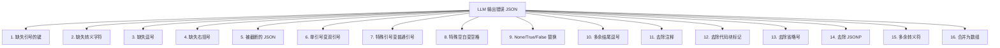

# json-repair 修复 LLM 输出 JSON 常见错误



---

| 错误类型 | 修复前 | 修复后 |
|---|---|---|
| 1. 缺失引号的键 | {name: "张三"} | {"name": "张三"} |
| 2. 缺失转义字符 | {"text": "He said "hello""} | {"text": "He said \"hello\""} |
| 3. 缺失逗号 | {"a": 1 "b": 2} | {"a": 1, "b": 2} |
| 4. 缺失右括号 | {"a": 1, "b": 2 | {"a": 1, "b": 2} |
| 5. 被截断的 JSON | {"a": 1, | {"a": 1} |
| 6. 单引号变双引号 | {'a': 1, 'b': 2} | {"a": 1, "b": 2} |
| 7. 特殊引号变普通引号 | {“a”: 1, “b”: 2} | {"a": 1, "b": 2} |
| 8. 特殊空白变空格 | {"a": 1, "b": 2} | {"a": 1, "b": 2} |
| 9. None/True/False 替换 | {"a": None, "b": True, "c": False} | {"a": "None", "b": true, "c": false} |
| 10. 多余结尾逗号 | {"a": 1, "b": 2,} | {"a": 1, "b": 2} |
| 11. 去除注释 | {"a": 1, /* 注释 */ "b": 2} | {"a": 1, "b": 2} |
| 12. 去除代码块标记 | ```json {"a": 1, "b": 2} ``` | {"a": 1, "b": 2} |
| 13. 去除省略号 | [1, 2, 3, ...] | [1, 2, 3] |
| 14. 去除 JSONP | callback({"a": 1, "b": 2}) | {"a": 1, "b": 2} |
| 15. 多余转义符 | "{\"a\": 1, \"b\": 2}" | {"a": 1, "b": 2} |
| 16. 合并为数组 | 每行一个 JSON 对象 | 合并为数组 |

``` 