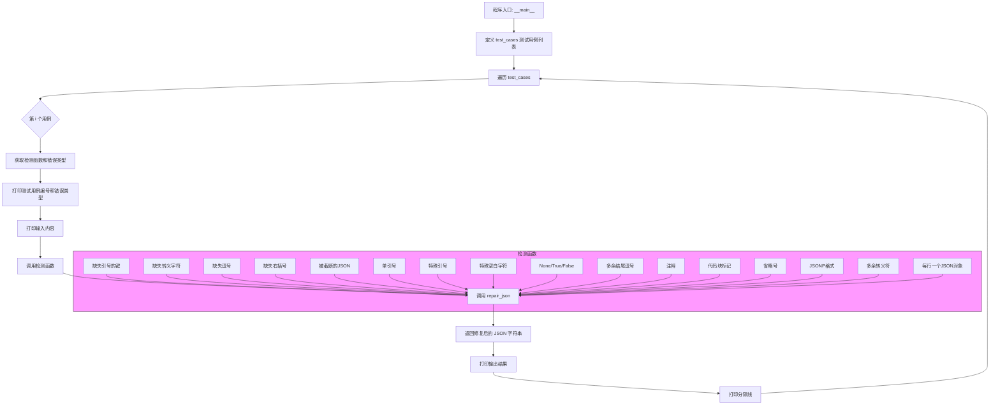

# validate.py 主流程 Mermaid 流程图

---

## 说明
- 每个检测函数（如“缺失引号的键”等）都只是简单地调用了 `repair_json`，并没有独立的逻辑。
- 主流程是遍历测试用例，依次调用对应的检测函数，打印输入和输出。
- `repair_json` 是核心处理函数，所有检测函数都调用它。

如需更详细的分支（比如 `repair_json` 内部的处理细节），请补充其实现代码。 